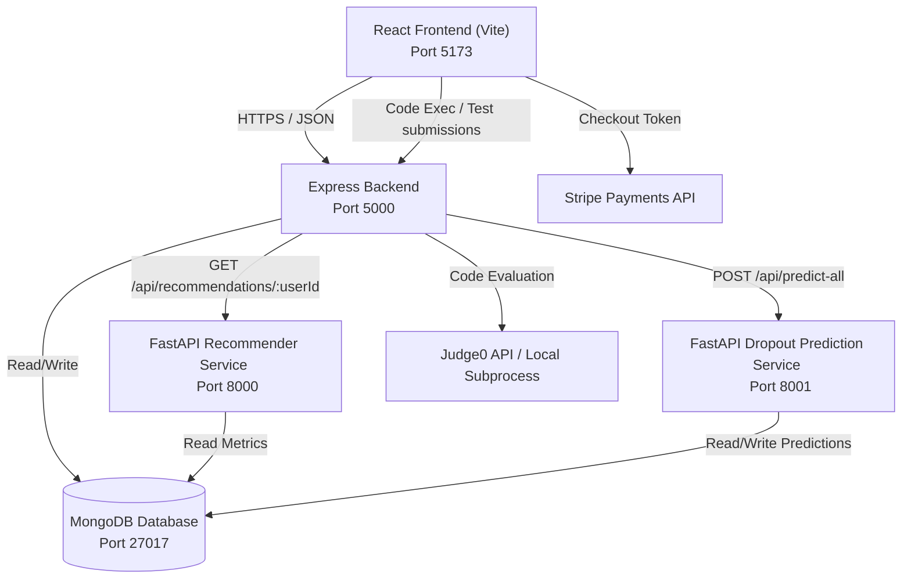

# Stride - Full-Stack Gamified Course Management Platform

Stride is a full-stack course management application that offers a gamified learning experience for students, an analytics dashboard for instructors, and a platform management console for admins. The system integrates real-time code execution, secure payments, and Python-based machine learning microservices that generate personalized course recommendations and predict student dropout risk.

---

## Architectural Overview

Stride utilizes a decoupled multi-service architecture consisting of a React SPA frontend, an Express API gateway (handling authentication, course management, and orchestrating downstream requests), a MongoDB database, and two independent Python FastAPI microservices for machine learning and analytics.



---

## Key Features

### For Students
*   **Dual Assessment Engine**: Each course features both a baseline Pre-Assessment and a Final Exam, accessible directly from the sidebar footer of the course content player.
*   **Interactive Content Players**: Stream video lessons, view PDF notes, answer quizzes, and solve coding challenges.
*   **Monaco Coding Sandbox & Grader**: Write and execute code in real-time. Students submit solutions to Python function-level challenges which are graded against hidden and public test cases via a Judge0 integration.
*   **Gamified Learning Loop**: Earn XP and level up by completing lessons, passing quizzes, finishing coding labs, and submitting assessments.
*   **Social Engagement**: Track progress streaks, unlock achievements, view earned badges, and view global rankings on the leaderboard.
*   **Privacy Controls**: Toggle profile visibility to control leaderboard participation.

### For Instructors
*   **Course Management Suite (CMS)**: Create, update, and publish rich multi-section courses with videos, articles, and assessments.
*   **Dual Assessment Builder**: Edit both the Pre-Assessment and the Final Exam using a tabbed toggler inside the course assessment tab.
*   **Analytics Dashboard**: Visual charts for course enrollment metrics, revenue projections, and average student completion rates.
*   **Dropout Risk Indicators**: Monitor student engagement scores, identifying at-risk learners through predicted dropout probability flags.

### For Admins
*   **Platform Dashboard**: Real-time stats on total courses, users, enrollments, and global system revenue.
*   **Verification Workflow**: Approve, reject, or request changes on newly created instructor courses.
*   **User Management**: Role assignment controls, activation toggles, and safety moderation tools.

---

## Recommender System Architecture

Stride features an advanced, multi-layer hybrid recommendation pipeline running on a dedicated FastAPI microservice. The service analyzes course metadata, peer enrollment graphs, and user history to output personalized suggestions complete with dynamic, human-readable explanations directly in the UI.

### Recommendation Pipeline Layers:
1. **Layer 1: Content-Based Similarity (TF-IDF)**: Calculates cosine similarities between courses based on their text profiles (titles, descriptions, categories, and tags). The system tracks the exact course that triggered a recommendation to provide explainable feedback: *"Similar to [Completed Course Title]"*.
2. **Layer 2: Collaborative Filtering (Jaccard Similarity)**: Evaluates user-to-user similarity graphs based on mutual course enrollments. Courses taken by peers with similar learning patterns are boosted, with the explanation: *"Highly rated by students with similar profiles"*.
3. **Layer 3: Rule-Based Engine (Progression & Prerequisites)**:
   - **Prerequisite Validation**: Case-insensitively checks course prerequisites against student course completion history to recommend suitable next steps: *"Building on your study of [Prerequisite Course Title]"*.
   - **Progression Controls**: Restricts intermediate and advanced recommendations to ensure logical progression, while automatically protecting against deadlocks for newly-created custom categories.
4. **Layer 4: Hybrid Ranking & Explanations**: Blends content scores, collaborative scores, popularity metrics (log-scaled enrollment and ratings), and exponential freshness decay to prioritize and label the top recommendations:
   - *"Top-rated [Level] course in [Category]"*
   - *"Popular introductory course in [Category]"*
   - *"Trending course in [Category]"*

---

## Technology Stack

| Component | Technologies & Libraries |
| :--- | :--- |
| **Frontend** | React 18, Vite, Tailwind CSS 4, DaisyUI 5, Framer Motion, Lottie React, Monaco Editor, Recharts, React Router 7, React Icons, Lucide |
| **Backend API Gateway** | Node.js, Express 5, Mongoose 9, jsonwebtoken (JWT), bcryptjs, Stripe API, Axios, express-validator |
| **Database** | MongoDB (Self-hosted or Atlas) |
| **ML Microservices** | FastAPI, Uvicorn, Pandas, Scikit-Learn, PyMongo, Joblib, NumPy, Pydantic |
| **Execution Engine** | Judge0 CE (RapidAPI) with local Python subprocess fallback execution |

---

## Directory Structure

```text
stride/
├── client/                     # Frontend configurations (e.g. .env.local)
├── dist/                       # Production build output
├── public/                     # Static frontend assets
├── server/                     # Express Backend codebase
├── │   ├── controllers/        # Request handlers (assessment, code execution, metrics)
├── │   ├── middleware/         # Auth guards & token verification
├── │   ├── models/             # Mongoose schemas (User, Course, Assessment, etc.)
├── │   ├── routes/             # Express route mappings
├── │   ├── services/           # Core business logic & metrics computations
├── │   ├── dropout_service/    # Python FastAPI Dropout Risk Predictor
├── │   │   ├── model/          # Serialized scikit-learn models & scalers
├── │   │   ├── app.py          # FastAPI server entry point (Port 8001)
├── │   │   └── train_model.py  # ML training pipeline script
├── │   ├── recommender_service/ # Python FastAPI Course Recommender
├── │   │   ├── app.py          # FastAPI server entry point (Port 8000)
├── │   │   └── recommender.py  # Content-based recommendation engine
├── │   ├── index.js            # Backend server entry point (Port 5000)
├── │   ├── seed.js             # MongoDB general data seeder
├── │   ├── seedAssessmentsOnly.js # Assessment schema seeder
├── │   └── seedCodingExercises.js # Seeding coding challenges & test cases
├── src/                        # React Frontend Source Code
├── │   ├── components/         # Reusable UI elements (common, forms, dashboard, etc.)
├── │   ├── pages/              # Top-level page views (Home, CourseDetails, etc.)
├── │   ├── routes/             # React Router definitions & route guards
├── │   ├── services/           # API axios services (api.js, courseService.js)
├── │   └── utils/              # Constants, helper utilities, and theme logic
├── index.html                  # Frontend HTML shell
└── package.json                # Project dependencies and workspace scripts
```

---

## Environment Variables Setup

### 1. Root & Frontend Client Configurations (`.env` & `client/.env.local`)
Create a `.env` in the root directory for standard options:
```env
PORT=5000
MONGODB_URI=mongodb://localhost:27017/stride
```

Create a `client/.env.local` for frontend environment options (Stripe payments and backend API base URL):
```env
VITE_API_URL=http://localhost:5000/api
VITE_STRIPE_PUBLISHABLE_KEY=pk_test_... # Optional: Stripe publishable key
```

### 2. Express Backend Server Configurations (`server/.env`)
Create a `.env` file inside the `server/` directory:
```env
PORT=5000
MONGODB_URI=mongodb://localhost:27017/stride
ACCESS_TOKEN_SECRET=your_jwt_secret_key_change_me_in_production
STRIPE_SECRET_KEY=sk_test_... # Optional: Fallback to mock responses if left blank
DROPOUT_SERVICE_URL=http://localhost:8001

# Judge0 API Settings
JUDGE0_API_URL=https://judge0-ce.p.rapidapi.com
JUDGE0_API_KEY=YOUR_RAPIDAPI_KEY # If left blank, server falls back to local Python subprocess execution
JUDGE0_API_HOST=judge0-ce.p.rapidapi.com
```

---

## Running the Project Locally

### 1. Prerequisites
*   **Node.js** (v18+)
*   **MongoDB** (running locally on port 27017 or a remote URI)
*   **Python 3.10+** (with virtual environment capability)

### 2. Install Dependencies & Seed Database
From the project root:
```powershell
# Install frontend dependencies
npm install

# Navigate to the server folder and install backend dependencies
cd server
npm install

# Seed the MongoDB database with initial sample data (Users, Courses, Enrollments)
npm run seed

# Seed baseline assessments for all courses
node seedAssessmentsOnly.js

# Seed Python coding problems and test cases
node seedCodingExercises.js
```

### 3. Spin up Python ML Microservices

#### Dropout Prediction Service (Port 8001)
```powershell
cd server/dropout_service
# Create and activate a virtual environment
python -m venv venv
.\venv\Scripts\Activate.ps1    # On Windows (PowerShell)
# source venv/bin/activate    # On Unix/macOS

# Install dependencies
pip install -r requirements.txt

# Train the initial prediction model using the CSV dataset
python train_model.py

# Start the FastAPI server using Uvicorn
python app.py
```

#### Course Recommender Service (Port 8000)
```powershell
cd server/recommender_service
# Create and activate a virtual environment
python -m venv venv
.\venv\Scripts\Activate.ps1    # On Windows (PowerShell)
# source venv/bin/activate    # On Unix/macOS

# Install dependencies
pip install -r requirements.txt

# Start the FastAPI server using Uvicorn
python app.py
```

### 4. Start the Application
Open two terminal windows:

*   **Terminal 1 (Express Backend)**:
    ```powershell
    cd server
    npm run dev
    ```
*   **Terminal 2 (React Frontend)**:
    ```powershell
    # Run from root directory
    npm run dev
    ```
Open your browser and navigate to `http://localhost:5173`.

---

## Database Models

Stride defines Mongoose collections inside `server/models/`:

1.  **User**: Stores credential hashes, profile details, active roles (`student`, `instructor`, `admin`), streak data, current level, and accumulated XP.
2.  **Course**: Contains information on pricing, categorizations, instructor IDs, and overall student registration counts.
3.  **Enrollment**: Maps student IDs to course IDs, tracking progress percentage, active module history, and grading averages.
4.  **CourseContent**: Holds structured curriculum sections, mapping lessons (video, article, quiz, and coding exercise metadata with test cases).
5.  **Assessment**: Houses topic-based Pre-Assessments and Final Exams, separated by the `type` field, containing multiple-choice, true/false, fill-in-the-blanks, and concept-matching questions. Unique constraints are enforced via `{ courseId, type }`.
6.  **MLFeature / StudentMetric**: Aggregates login counts, active days, session lengths, lessons completed, and assessment scores that feed into the ML dropout prediction engine.

---

## Security & Data Isolation

Stride implements multiple layers of security to guarantee data privacy, safe request routing, and protected code execution:

1. **Secure Session States**: User credentials (email/password) are submitted securely to custom authentication backend endpoints, where registration and logins are validated using bcrypt password hashing. Successful logins generate cryptographically signed JWT tokens passed via HTTP headers and encrypted in transit by HTTPS/TLS.
2. **Backend Route Guards (RBAC)**: All API routes (such as dropout predictions or course modifications) are protected by a chain of Express authentication and authorization middlewares (`verifyToken`, `requireRole`) verifying roles (`Student`, `Instructor`, `Admin`).
3. **Execution Sandbox**: Student code submissions are executed within isolated, resource-constrained container environments (using Judge0 CE API) or structured fallback subprocess pipes to prevent arbitrary shell command injections or execution exploits on server hosts.
4. **NoSQL Injection & Sanitization**: Using MongoDB with Mongoose natively prevents traditional SQL injections. Mongoose enforces strict schema matching and automatically sanitizes/casts query fields, while `express-validator` middleware filters out illegal parameters before processing.
5. **DDoS Mitigation**: Production deployment is optimized for cloud platforms (e.g. Vercel/Cloudflare Edge networks) that mitigate volumetric DDoS attacks. Application-level limits on body parser payloads (50MB) and Monaco sandbox runtime timeouts (5s) prevent resource exhaustion attacks.

> [!WARNING]
> **Production Hardening**: For production deployment, you must: (1) disable the local subprocess python execution fallback (which executes code directly on the host machine if the Judge0 key is missing), (2) enforce a strong `ACCESS_TOKEN_SECRET` key and disable default `'secret'` fallbacks, and (3) disable mock billing fallouts on Stripe endpoints.
