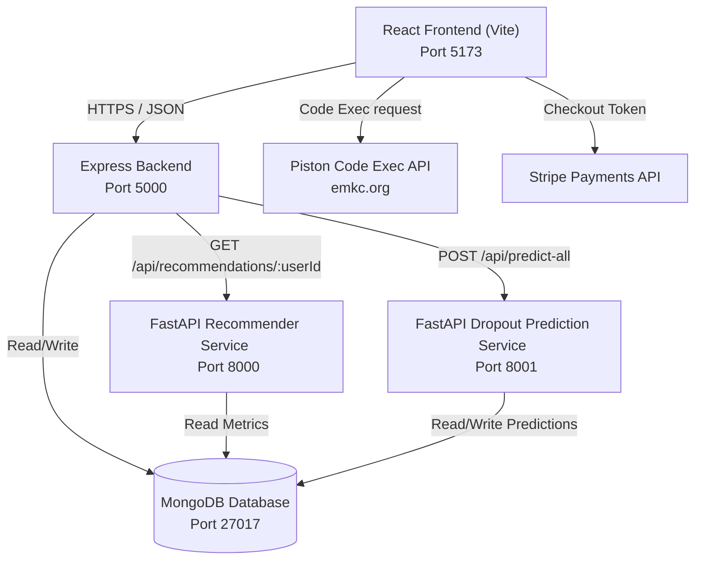

# 🚀 Stride — Full-Stack Gamified Course Management Platform

Stride is a modern, premium full-stack course management application that offers a gamified learning experience for students, an analytics-heavy dashboard for instructors, and a comprehensive platform management console for admins. The system integrates real-time code execution, secure payments, and **Python-based Machine Learning microservices** that generate personalized course recommendations and predict student dropout risk.

---

## 🗺️ Architectural Overview

Stride utilizes a **decoupled multi-service architecture** consisting of a React SPA frontend, an Express API gateway (handling authentication, course management, and orchestrating downstream requests), a MongoDB database, and two independent Python FastAPI microservices for machine learning and analytics.



---

## 🌟 Key Features

### 🎓 For Students
*   **Interactive Content Players**: Stream video lessons, view PDF notes, answer quizzes, and solve coding challenges.
*   **Integrated Code Sandbox**: Execute code in real-time inside lessons using a Monaco Editor integration that proxies compilation to the Piston API.
*   **Gamified Learning Loop**: Earn **XP** and level up by completing lessons, passing quizzes, and finishing challenges.
*   **Social Engagement**: View progress streaks, achievements, unlocked badges, and climb the public leaderboard.
*   **Privacy Controls**: Toggle profile visibility to control leaderboard participation.

### 👨‍🏫 For Instructors
*   **Course Management Suite (CMS)**: Create, update, and publish rich multi-section courses with videos, articles, and assessments.
*   **Analytics Dashboard**: Visual charts for course enrollment metrics, revenue projections, and average student completion rates.
*   **Dropout Risk Indicators**: Monitor student engagement scores, identifying at-risk learners through predicted dropout probability flags.

### 🔑 For Admins
*   **Platform Dashboard**: Real-time stats on total courses, users, enrollments, and global system revenue.
*   **Verification Workflow**: Approve, reject, or request changes on newly created instructor courses.
*   **User Management**: Role assignment controls, activation toggles, and safety moderation tools.

---

## 🛠️ Technology Stack

| Component | Technologies & Libraries |
| :--- | :--- |
| **Frontend** | React 18, Vite, Tailwind CSS 4, DaisyUI 5, Framer Motion, Lottie React, Monaco Editor, Recharts, React Router 7, React Icons, Lucide |
| **Backend API Gateway** | Node.js, Express 5, Mongoose 9, jsonwebtoken (JWT), bcryptjs, Stripe API, Axios, express-validator |
| **Database** | MongoDB (Self-hosted or Atlas) |
| **ML Microservices** | FastAPI, Uvicorn, Pandas, Scikit-Learn, PyMongo, Joblib, NumPy, Pydantic |

---

## 📁 Directory Structure

```text
stride/
├── client/                     # Frontend configurations (e.g. .env.local)
├── dist/                       # Production build output
├── public/                     # Static frontend assets
├── server/                     # Express Backend codebase
│   ├── controllers/            # Request handlers
│   ├── middleware/             # Auth guards & token verification
│   ├── models/                 # Mongoose schemas (User, Course, MLFeature, etc.)
│   ├── routes/                 # Express route mappings
│   ├── services/               # Core business logic & metrics computations
│   ├── dropout_service/        # Python FastAPI Dropout Risk Predictor
│   │   ├── model/              # Serialized scikit-learn models & scalers
│   │   ├── app.py              # FastAPI server entry point (Port 8001)
│   │   └── train_model.py      # ML training pipeline script
│   ├── recommender_service/    # Python FastAPI Course Recommender
│   │   ├── app.py              # FastAPI server entry point (Port 8000)
│   │   └── recommender.py      # Content-based recommendation engine
│   ├── index.js                # Backend server entry point (Port 5000)
│   └── seed.js                 # MongoDB data seeder
├── src/                        # React Frontend Source Code
│   ├── components/             # Reusable UI elements (common, dashboard, etc.)
│   ├── pages/                  # Top-level page views (Home, CourseDetails, etc.)
│   ├── routes/                 # React Router definitions & route guards
│   ├── services/               # API axios services (api.js, courseService.js)
│   └── utils/                  # Constants, helper utilities, and theme logic
├── index.html                  # Frontend HTML shell
└── package.json                # Project dependencies and workspace scripts
```

---

## ⚙️ Environment Variables Setup

### 1. Root & Frontend Client Configurations (`.env` & `client/.env.local`)
Create a `.env` in the root directory for standard options:
```env
PORT=5000
MONGODB_URI=mongodb://localhost:27017/stride
```

Create a `client/.env.local` or copy values into your environment for Firebase configurations (used in early stages of authorization):
```env
apiKey=YOUR_FIREBASE_API_KEY
authDomain=YOUR_FIREBASE_AUTH_DOMAIN
projectId=YOUR_PROJECT_ID
storageBucket=YOUR_STORAGE_BUCKET
messagingSenderId=YOUR_MESSAGING_SENDER_ID
appId=YOUR_APP_ID
```

### 2. Express Backend Server Configurations (`server/.env`)
Create a `.env` file inside the `server/` directory:
```env
PORT=5000
MONGODB_URI=mongodb://localhost:27017/stride
ACCESS_TOKEN_SECRET=your_jwt_secret_key_change_me_in_production
STRIPE_SECRET_KEY=sk_test_... # Optional: Fallback to mock responses if left blank
DROPOUT_SERVICE_URL=http://localhost:8001
```

---

## 🚀 Running the Project Locally

### 1. Prerequisites
*   **Node.js** (v18+)
*   **MongoDB** (running locally on port 27017 or a remote URI)
*   **Python 3.10+** (with virtual environment capability)

### 2. Install Dependencies & Seed Database
From the project root:
```powershell
# Install frontend dependencies
npm install

# Navigate to the server folder and install backend dependencies
cd server
npm install

# Seed the MongoDB database with initial sample data (Users, Courses, Enrollments, Assessments)
# Note: Ensure MongoDB is active before running this command.
npm run seed
```

### 3. Spin up Python ML Microservices

#### 📉 Dropout Prediction Service (Port 8001)
```powershell
cd server/dropout_service
# Create and activate a virtual environment
python -m venv venv
.\venv\Scripts\Activate.ps1    # On Windows (PowerShell)
# source venv/bin/activate    # On Unix/macOS

# Install dependencies
pip install -r requirements.txt

# Train the initial prediction model using the CSV dataset
python train_model.py

# Start the FastAPI server using Uvicorn
python app.py
```

#### 🎯 Course Recommender Service (Port 8000)
```powershell
cd server/recommender_service
# Create and activate a virtual environment
python -m venv venv
.\venv\Scripts\Activate.ps1    # On Windows (PowerShell)
# source venv/bin/activate    # On Unix/macOS

# Install dependencies
pip install -r requirements.txt

# Start the FastAPI server using Uvicorn
python app.py
```

### 4. Start the Application
Open two terminal windows:

*   **Terminal 1 (Express Backend)**:
    ```powershell
    cd server
    npm run dev
    ```
*   **Terminal 2 (React Frontend)**:
    ```powershell
    # Run from root directory
    npm run dev
    ```
Open your browser and navigate to `http://localhost:5173`.

---

## 🗄️ Database Models

Stride defines 7 main Mongoose collections inside `server/models/`:

1.  **User**: Stores credential hashes, profile details, active roles (`student`, `instructor`, `admin`), streak data, current level, and accumulated XP.
2.  **Course**: Contains information on pricing, categorizations, instructor IDs, and overall student registration counts.
3.  **Enrollment**: Maps student IDs to course IDs, tracking their current progress percentage, active module history, and calculated grading averages.
4.  **CourseContent**: Holds structured curriculum sections, mapped directly to individual video, article, quiz, and coding exercise metadata.
5.  **Assessment**: Houses topic-based quizzes and exams containing multiple-choice, true/false, fill-in-the-blanks, and concept-matching questions.
6.  **MLFeature / StudentMetric**: Aggregates the 12+ real-time session tracking parameters (login counts, active days, session lengths, lessons completed, assessment scores) that feed into the ML dropout prediction engine.

---

## 📂 API Reference

| Endpoint | Method | Security | Description |
| :--- | :--- | :--- | :--- |
| `/api/auth/register` | `POST` | Public | Register a new user |
| `/api/auth/login` | `POST` | Public | Authenticate a user and return JWT |
| `/api/users/me` | `GET` | Protected | Fetch current user's profile |
| `/api/courses` | `GET` | Public | Retrieve all active courses |
| `/api/courses/:id` | `GET` | Public | Fetch a course by ID |
| `/api/courses` | `POST` | Protected (Instructor/Admin) | Create a new course |
| `/api/enrollments` | `POST` | Protected | Enroll in a course |
| `/api/enrollments/my-enrollments` | `GET` | Protected | Fetch current student's course list |
| `/api/gamification/leaderboard` | `GET` | Public | Retrieve global student rankings |
| `/api/recommendations` | `GET` | Protected | Get personalized courses recommendations |
| `/api/dropout/predictions` | `GET` | Protected (Instructor) | Retrieve flagged dropout-risk students |
