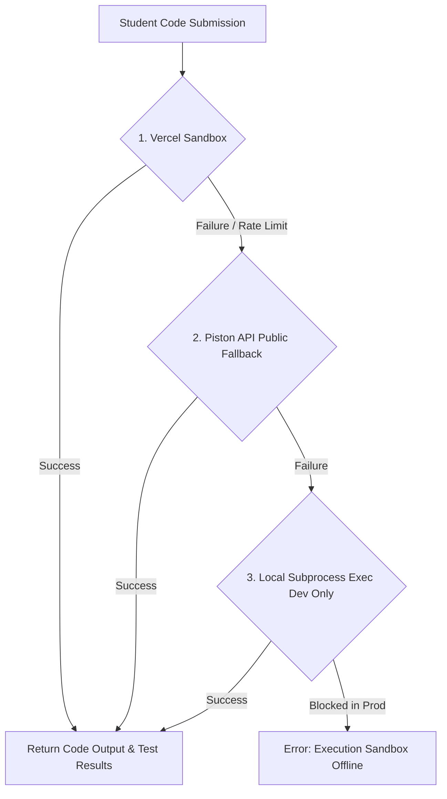

# STRIDE: MIDYEAR SHORT DOCUMENTATION

## 1. ABSTRACT

Stride is a modern, full-stack course management and learning platform designed to bridge the gap between instructors and students in digital education. The platform addresses the lack of unified, interactive learning experiences by providing a comprehensive ecosystem where students can discover, enroll in, and complete courses while instructors can create and manage course content efficiently. Our motivation stems from the increasing demand for accessible online learning tools that combine flexibility with structured educational delivery. Stride leverages a modern technology stack including React 18 for responsive user interfaces, a REST API backend for scalable data management, custom Node.js/Express authentication with bcrypt password hashing, and MongoDB for flexible document-oriented data storage. The platform implements role-based access control, interactive course content with quizzes and coding exercises, progress tracking, and personalized course recommendations, making it a complete solution for online education delivery.

## 2. BACKGROUND

### 2.1 Introduction to Online Learning Platforms

Online learning has become an essential component of modern education. Traditional educational systems face challenges in scalability, accessibility, and student engagement. Digital learning platforms provide solutions by offering flexibility, personalized learning paths, and on-demand access to educational content.

### 2.2 Motivation

The primary motivation for developing Stride is to create a unified platform that:
- Provides seamless course discovery and enrollment experiences
- Empowers instructors with tools to create and manage courses effectively
- Tracks student progress and learning outcomes
- Delivers interactive, engaging educational content
- Supports multiple user roles with appropriate access levels

### 2.3 Beneficiaries

- **Students**: Access to diverse courses, structured learning paths, progress tracking, and personalized recommendations
- **Instructors**: Tools to manage courses, view student progress, and create interactive content
- **Administrators**: System oversight, user management, and platform analytics
- **Educational Institutions**: Scalable infrastructure for digital education delivery

### 2.4 Main Techniques & Features

- **Authentication & Security**: Custom credentials authentication (bcrypt) with JWT token management
- **Interactive Content**: Article lessons, video tutorials, quizzes, and coding exercises
- **Progress Tracking**: XP-based progression system and course completion metrics
- **Recommendation Engine**: Hybrid 4-layer recommendation system (content-based, collaborative, rule-based, and ranking) with dynamic explainability reasons (XAI)
- **Role-Based Access Control**: Distinct interfaces and functionality for students, instructors, and admins

### 2.5 Main Applications

- Online course delivery for educational institutions
- Professional skill development platforms
- Coding bootcamps and technical training programs
- Self-paced learning systems

## 3. PROBLEM DEFINITION

### 3.1 Current Challenges

1. **Fragmented Learning Experience**: Existing solutions lack integrated platforms that combine course content, assessment, and progress tracking
2. **Limited Instructor Tools**: Instructors require simplified interfaces for course creation and management without technical complexity
3. **Student Engagement**: Traditional online courses fail to maintain student motivation and engagement
4. **Scalability Issues**: Legacy systems cannot efficiently handle growing numbers of users and courses
5. **Personalization Gap**: Most platforms lack personalized learning recommendations based on student progress and interests

### 3.2 Research Question

How can we design and implement a unified, interactive course management platform that enhances both teaching and learning experience through intelligent content organization, interactive assessments, and personalized recommendations?

### 3.3 Specific Problems We Address

- Unified course discovery with multi-criteria filtering
- Role-based access control and user management
- Interactive lesson delivery with multiple content types
- Progress tracking with XP-based gamification
- Seamless integration of quizzes and coding exercises
- Personalized course recommendations

## 4. RELATED WORK

### 4.1 Existing Similar Implementations

| Platform | Key Features |
|----------|---------------|
| Udemy | Large course catalog, instructor dashboards, student progress tracking, certificates |
| Coursera | Structured learning paths, university-backed courses, certificates, specializations |
| Udacity | Nanodegree programs, project-based learning, mentorship, industry partnerships |

### 4.2 Main Differences from Stride

| Feature | Udemy | Coursera | Udacity | Stride |
|---------|-------|----------|---------|--------|
| Interactive Code Execution | None | Limited/External | Separate environments | Web-based IDE with real-time code execution |
| Pre-Assessment Quizzes | None | Some courses have initial assessments | Limited | Mandatory pre-assessment to gauge baseline |
| Gamification Features | Basic progress bars, instructor badges | Course completion certificates | Nanodegree badges, certifications | XP system, achievement badges, levels, leaderboards |
| Recommendation System | Popularity-based, category browsing | Playlist personalization (ML) | Manual course sequencing | Hybrid 4-layer (content-based + collaborative + rule-based + ranking) |
| Student Dropout Prediction | None | None | None | ML model identifies at-risk students |
| At-Risk Student Alerts | None | None | None | Real-time instructor notifications |
| Intervention Recommendations | Instructor discretion only | Limited | Mentorship focus | AI-suggested actions for at-risk students |
| Performance Analytics | Basic (completion %, average scores) | Moderate (by module) | Limited (project-focused) | Comprehensive (engagement + performance + risk + trends) |

### 4.3 Innovation in Stride

- Integrated Coding Environment
- AI-suggested actions for at-risk students
- Mandatory pre-assessment to gauge baseline

## 5. PROJECT SPECIFICATIONS

### 5.1 System Architecture

**Architecture Overview:**
- **Frontend**: React 18 with Vite bundler, Tailwind CSS + Daisy UI for styling
- **Backend**: REST API (Node.js/Express)
- **Authentication**: Custom Auth (bcrypt) + JWT tokens
- **Database**: MongoDB (document-oriented database storing courses, content, users, enrollments, assessments, and metrics)
- **External Services**: Vercel Sandbox API (sandboxed code execution / automated grading with local Python subprocess fallback), YouTube (video content)

**Key Architectural Layers:**
1. **Presentation Layer**: React components organized by features (auth, courses, dashboard, users, assessment)
2. **API Layer**: Axios interceptors for secure requests, centralized service layer
3. **Business Logic**: Hooks for reusable logic, context API for state management
4. **Data Layer**: MongoDB for authentication (bcrypt) and persistence

### 5.2 Stakeholders

| Stakeholder | Role | Interests |
|-------------|------|-----------|
| Students | End users | Access to quality courses, progress tracking, certifications |
| Instructors | Content creators | Course management tools, student analytics, income/recognition |
| Admins | System administrators | User management, content moderation, platform analytics |

### 5.3 Functional Requirements

#### FR 2.1. User Management and Authentication

| ID | Requirement Description | Actor |
|----|------------------------|-------|
| FR-2.1.1 | The system must allow users to register and log in via secure credentials (email/password). | Student, Instructor, Admin |
| FR-2.1.2 | The system must implement role-based access control (RBAC) for three roles: Student, Instructor, and Admin. | System |
| FR-2.1.3 | The system must maintain a secure session for authenticated users (using JWT or similar). | System |
| FR-2.1.4 | The system must provide a central Course Dashboard displaying enrolled courses and overall progress. | Student |

#### FR 2.2. AI Recommendation & Dropout Prediction Engine

| ID | Requirement Description | Actor |
|----|------------------------|-------|
| FR-2.2.1 | The system must administer a pre-assessment quiz to gauge the student's initial knowledge level upon course enrollment. | Student |
| FR-2.2.2 | The system must execute a hybrid 4-layer recommendation engine (content-based, collaborative, rule-based, ranking) to offer personalized suggestions. | System |
| FR-2.2.3 | The system must display dynamic, human-readable explanations (e.g., "Similar to HTML & CSS Foundations") for recommendations. | System |
| FR-2.2.4 | The system must analyze weekly behavioral data (logins, progress, active time) using an ML model to flag at-risk students for instructors. | System |

#### FR 2.3. Interactive Content Players

| ID | Requirement Description | Actor |
|----|------------------------|-------|
| FR-2.3.1 | The Quiz Player must support multiple question types (MCQ, fill-in-the-blank, matching). | Student |
| FR-2.3.2 | The Quiz Player must provide instant feedback upon submission (correct/incorrect). | Student |
| FR-2.3.3 | The Coding Playground must provide a web-based IDE for users to write and execute code. | Student |
| FR-2.3.4 | The Coding Playground must integrate with an external sandboxed execution API to run code against defined test cases and return real-time feedback. | System |

#### FR 2.4. Gamification Engine

| ID | Requirement Description | Actor |
|----|------------------------|-------|
| FR-2.4.1 | The system must award Experience Points (XP) for completing modules, quizzes, and coding challenges. | System |
| FR-2.4.2 | The system must award Achievement Badges upon meeting specific, pre-defined criteria (e.g., perfect scores). | System |
| FR-2.4.3 | The system must display a visual progress bar showing XP gained and progress toward the next level/milestone. | Student |
| FR-2.4.4 | The system must render a Leaderboard displaying student rankings, with optional privacy settings. | Student |

#### FR 2.5. Content Management System (CMS)

| ID | Requirement Description | Actor |
|----|------------------------|-------|
| FR-2.5.1 | The CMS must allow Instructors/Admins to create and structure new courses, modules, and lessons. | Instructor, Admin |
| FR-2.5.2 | The CMS must provide a user-friendly interface to create, edit, and publish interactive quiz questions. | Instructor, Admin |
| FR-2.5.3 | The CMS must provide tools to define coding exercise test cases and expected outputs for automated grading. | Instructor, Admin |
| FR-2.5.4 | The CMS must include an Analytics Dashboard to view aggregated student performance data (e.g., average scores, completion rates). | Instructor, Admin |

### 5.4 Non-Functional Requirements (NFR)

#### NFR 3.1. Performance

| ID | Requirement Description | Priority |
|----|------------------------|----------|
| NFR-3.1.1 | The system must load all key dashboard and course pages in acceptable time | High |
| NFR-3.1.2 | The real-time code execution and feedback (via sandboxed execution environment) must return results | High |
| NFR-3.1.3 | The Hybrid Recommendation Engine must generate personalized course suggestions within acceptable time limits | High |

#### NFR 3.2. Security

| ID | Requirement Description | Priority |
|----|------------------------|----------|
| NFR-3.2.1 | All user passwords must be securely stored | Critical |
| NFR-3.2.2 | The Coding Sandbox must be meticulously isolated (e.g., using Docker containerization) to prevent security breaches and code injection. | Critical |
| NFR-3.2.3 | All data transmission between the client and server must be encrypted via HTTPS/TLS. | High |

#### NFR 3.3. Usability and Accessibility (UI/UX)

| ID | Requirement Description | Priority |
|----|------------------------|----------|
| NFR-3.3.1 | The frontend must be fully responsive | High |
| NFR-3.3.2 | The platform must maintain a consistent, intuitive design language across all modules. | High |

#### NFR 3.4. Scalability and Maintainability

| ID | Requirement Description | Priority |
|----|------------------------|----------|
| NFR-3.4.1 | The system architecture (Node.js/Express/MongoDB) must be able to support 10,000 concurrent active student sessions. | High |
| NFR-3.4.2 | The codebase must use modular, component-based architecture (React) to facilitate easy maintenance and feature expansion. | High |
| NFR-3.4.3 | The system must be deployable via Docker containers | High |

### 5.5 Use Case Diagram

*(Diagram placeholder)*

### 5.6 Class Diagram

*(Diagram placeholder)*

### 5.7 Sequence Diagram

- **ADD Course Sequence Diagram**: *(placeholder)*
- **Enroll in Course Sequence Diagram**: *(placeholder)*
- **Coding Exercise Sequence Diagram**: *(placeholder)*

### 5.8 Activity Diagram

*(Diagram placeholder)*

### 5.9 Entity Relationship Diagram (ERD)

*(Diagram placeholder)*

## 6. AI PLAN

### 6.1 RECOMMENDER SYSTEM: DETAILED DESIGN

#### 6.1.1 Overview

The recommender system employs a hybrid layered approach to ensure robust and personalized discovery, effectively handling "cold start" scenarios for new users and courses.

#### 6.1.2 Architecture Layers

1. **Layer 1: Content-Based Filtering**: Represents courses as vectors derived from metadata using TF-IDF. We calculate cosine similarity between these vectors to find courses similar to those a user has already enrolled in.

2. **Layer 2: Collaborative Filtering**: Identifies "neighbor" users with similar tastes and enrollment histories to recommend courses that the current user hasn't seen yet.

3. **Layer 3: Knowledge-Based / Rule-Based**: Encodes explicit logic such as prerequisite checking and difficulty progression (e.g., don't suggest Advanced Python to a user who hasn't completed Intro to Python).

4. **Layer 4: Hybrid Model & Ranking**: Gathers a broad pool of candidates from all layers and re-ranks them using a weighted formula that considers popularity, freshness, and relevance.

#### 6.1.3 Recent Enhancements: Robustness & Explainable AI (XAI)

To prepare Stride for reliable, human-centric evaluation, several updates were implemented across the recommendation service:

- **Robust Level Progression & Prerequisites**: Prerequisite validation was upgraded to perform case-insensitive, whitespace-trimmed title comparisons. Furthermore, difficulty progression rules were refactored to check if lower-level courses actually exist in the database for a given category.

- **Explainable AI (XAI) Reasons**: The hybrid ranking pipeline now dynamically computes a human-readable explanation (reason) for each recommended course. Examples include: "Similar to [Completed Course Title]", "Building on your study of [Prerequisite Course Title]", or "Highly rated by students with similar profiles".

- **Consistent Fallback Explanations**: The Express API gateway fallback logic was aligned to attach category-based labels (e.g., "Similar course in [Category]") for course-to-course detail recommendations.

### 6.2 STUDENT RETENTION: DROPOUT PREDICTION MODEL

#### 6.2.1 Overview

To improve student retention, Stride incorporates an ML model that provides "Early Warnings" by analyzing behavioral data from the previous 7 days to predict dropout probability in the upcoming week.

#### 6.2.2 Logic

- **Data Points**: Weekly login frequency, lesson completion rate, assessment/quiz performance, average engagement time, and interaction recency.
- **Implementation**:
  1. Data Aggregation: Backend aggregates logs every Sunday.
  2. Inference: Data is processed by the ML service to generate a Risk Score (0.0 to 1.0).
  3. Classification: Students with a score > 0.7 are flagged as "At-Risk."
  4. Intervention: These students are highlighted on the Instructor Dashboard for proactive outreach.

#### 6.2.3 Feature List

The student retention ML model utilizes **12 raw behavioral features** aggregated over a rolling 7-day window:

1.  **`login_count`**: Frequency of user logins during the week.
2.  **`days_active`**: Total unique days of active platform engagement.
3.  **`total_session_time_minutes`**: Cumulative learning session duration.
4.  **`avg_session_time_minutes`**: Mean session length per login.
5.  **`median_session_time_minutes`**: Median session length.
6.  **`lessons_started`**: Total lessons opened.
7.  **`lessons_completed`**: Total lessons completed.
8.  **`assessments_attempted`**: Total quiz and exam submissions.
9.  **`avg_assessment_score`**: Average grading score achieved on assessments.
10. **`num_failed_attempts`**: Count of attempts scoring below passing threshold (60%).
11. **`num_repeated_attempts`**: Count of assessment retries.
12. **`no_improvement_attempts`**: Count of retries showing no score gain.

### 6.3 STUDENT DROPOUT MODEL EVALUATION RESULTS

To identify the most reliable estimator for predicting student dropout risk over the next 7 days, five machine learning models were optimized using 5-fold cross-validated grid search (`GridSearchCV`) and evaluated on a held-out test set ($20\%$ of the data).

#### 6.3.1 Model Performance Summary

| Model Name | Accuracy | Precision | Recall | F1 Score | AUC-ROC |
| :--- | :---: | :---: | :---: | :---: | :---: |
| **Random Forest** | **97.17%** | **96.30%** | **84.78%** | **90.17%** | **99.17%** |
| Gradient Boosting | 79.33% | 45.16% | 23.73% | 31.11% | 60.50% |
| K-Nearest Neighbors (KNN) | 76.17% | 35.63% | 26.27% | 30.24% | 58.03% |
| Logistic Regression | 80.00% | 45.45% | 8.47% | 14.29% | 67.51% |
| SVC | 79.33% | 12.50% | 0.85% | 1.59% | 54.95% |

#### 6.3.2 Algorithmic Performance Analysis

The results demonstrate a massive performance gap between the **Random Forest** classifier ($90.17\%$ F1-Score) and the other models ($1.59\% - 31.11\%$ F1-Score) due to the structural design and mathematical assumptions of each estimator:

1. **Random Forest (F1-Score: 90.17%) — *The Dominant Model***:
   * **Bagging and Variance Reduction**: Constructs a forest of uncorrelated decision trees. By averaging their predictions, it effectively reduces model variance and ignores local noise in noisy, conflicting data points.
   * **Non-Linear Decision Boundaries**: Student behavioral metrics (such as completing lessons or quiz failures) exhibit step-function thresholds (e.g., "lessons completed $\le 3$ AND assessments attempted $= 0$"). Decision trees naturally model these orthogonal, recursive partitions far better than distance-based hyperplanes.
   * **Inherent Feature Interaction Handling**: Random Forest automatically captures multi-way feature interactions (e.g., combining `login_count` with `avg_session_time_minutes`) without requiring explicitly mapped polynomial terms.

2. **Gradient Boosting Classifier (F1-Score: 31.11%)**:
   * **Sensitivity to Overlapping Boundaries**: Unlike Random Forest, Gradient Boosting builds trees sequentially to minimize the residuals (errors) of prior trees. In complex, overlapping feature distributions, boosting has a high tendency to overfit the training set's local noise, resulting in poor generalization on unseen test data.
   * **Lack of Variance Control**: Focuses on bias reduction rather than variance reduction, struggling to ignore high-frequency noise and yielding a weak recall ($23.73\%$).

3. **K-Nearest Neighbors (KNN) (F1-Score: 30.24%)**:
   * **Local Density Distortion**: KNN makes predictions based on local spatial distance (Euclidean/Manhattan metric). In this dataset, overlapping feature spaces confuse distance metrics; if a disengaged student clusters near a active one due to minor metric similarities, KNN misclassifies the neighborhood.
   * **Sensitivity to Feature Correlation**: Distance-based voting is heavily distorted by multi-collinear features (e.g., `lessons_started` vs. `lessons_completed`), reducing KNN's classification accuracy.

4. **Logistic Regression (F1-Score: 14.29%)**:
   * **Strict Linear Assumption**: Logistic Regression assumes that a linear combination of features can cleanly separate the two classes via a logistic hyperplane. Because the decision boundary of student dropouts is highly non-linear, a single linear boundary underfits the data.
   * **Zero-Coefficient Collapse**: In an attempt to handle overlapping and noisy data distributions, the $L_2$ regularization penalty forces coefficients towards zero, causing the model to miss subtle linear trends and yield a very low recall ($8.47\%$).

5. **Support Vector Classifier (SVC) (F1-Score: 1.59%)**:
   * **Margin Maximization Failure**: SVC attempts to find an optimal separating hyperplane that maximizes the margin between classes. RBF SVMs are highly sensitive to overlapping class distributions where clear separation is impossible.
   * **Majority-Class Collapse**: When margins are heavily overlapping, the optimization objective of SVC collapses to predicting the majority class (`0` - No Dropout) to maximize accuracy. This explains why SVC achieved an $80\%$ accuracy but a near-zero Recall ($0.85\%$) and a degenerate F1-Score ($1.59\%$).

---

## 7. SECURITY

Stride implements a multi-layered security strategy to protect user data, secure session states, control role-based permissions, and sandbox user code execution.

### 7.1 Authentication & Session Management
- **Custom Credentials Authentication**: User credentials and registrations are processed directly by the backend REST API. Passwords are securely hashed using bcrypt prior to database storage.
- **JWT Tokens (JSON Web Tokens)**: Upon successful authentication, the Express backend issues a cryptographically signed JWT using `jsonwebtoken` that contains the user's ID, email, and role.
- **Transmission Security**: The token is passed via HTTP headers (`Authorization: Bearer <token>`) for all subsequent requests to the Express gateway and is encrypted in transit using HTTPS/TLS.

### 7.2 Role-Based Access Control (RBAC)
- Three specific roles are defined: `Student`, `Instructor`, and `Admin`.
- **Backend Authorization Middleware**: The backend enforces access control using an Express middleware pipeline:
  - `verifyToken`: Decodes and validates the JWT.
  - `requireRole`: Checks if the decoded user role matches the authorized roles (e.g. `requireRole('admin')`, `requireRole('instructor')`).
- **Frontend Adaptations**: The React Router and dashboard navigation dynamically adjust views based on the active role, but all key mutation operations are blocked by API-level guards.

### 7.3 Coding Sandbox Isolation & Safe Execution
Running arbitrary user code presents a security hazard (file access, infinite loops, memory leaks). Stride employs a dual execution model to mitigate this:
- **Primary Sandbox (Vercel Sandbox)**: User-submitted code is sent to the Vercel Sandbox. It runs the untrusted script within a strictly isolated, containerized sandbox with resource limitations on execution time (e.g., 5 seconds), CPU usage, and RAM.
- **Fallback Local Execution**: When the sandboxed environment is unavailable, Stride spawns a local subprocess (`child_process.spawn`) configured with input/output piping (stdin/stdout). Code is checked against precise test assertions and wrapped within isolated wrappers.

### 7.4 Input Sanitization & Data Safety (SQL/NoSQL Injection)
- **SQL Injection Immunity**: Because Stride utilizes a NoSQL document database (MongoDB via Mongoose), it does not compile SQL queries or concatenate database strings, making it structurally immune to traditional SQL injection attacks.
- **NoSQL Injection & Casting**: Mongoose schemas enforce strict type validation. Request parameters are cast automatically (e.g., validating ObjectIds); query parameters containing unpermitted objects (like query operators `{"$ne": null}`) are either cast to strings or stripped, preventing NoSQL injection.
- **Validation Middleware**: All inputs are checked using `express-validator` middleware to block improperly formed payloads before they can reach the database or backend logic.
- **CORS Configuration**: Cross-Origin Resource Sharing (CORS) is restricted to allowed origins (local development and registered Vercel domains), protecting routes from cross-site scripts.

### 7.5 DDoS & Infrastructure Protection
- **Edge Network Mitigations**: Stride is designed to be deployed behind CDNs and hosting edges (like Cloudflare or Vercel). These platforms automatically intercept and filter volumetric DDoS traffic at the DNS and reverse proxy level.
- **Request Sizing & Resource Limits**: Payload size limits on HTTP requests (e.g., Express JSON bodies capped at 50MB) and strict sandbox resource constraints (5-second timeout on code execution) prevent resource starvation and buffer overflow Denial of Service (DoS) attempts.

### 7.6 Production Hardening & Security Risk Disclaimers
While Stride implements standard web security models, several vulnerabilities exist in development configurations that must be hardened prior to production deployment:
1. **Local Subprocess Code Execution Fallback**:
   - *Risk*: If the sandboxing environment is not configured, Stride falls back to executing user-submitted Python code using the host machine's Python compiler via `child_process.spawn`. In a production environment, this allows malicious users to execute arbitrary code (e.g., read files, delete data, consume unlimited CPU/RAM resources, or spawn reverse shells) directly on the host machine.
   - *Hardening Recommendation*: Disable the local subprocess fallback in production. The system should throw an error and halt execution if the sandboxing configuration is missing or invalid.
2. **Weak JWT Secret Fallback**:
   - *Risk*: In `auth.js` and `index.js`, the JWT token secret defaults to a hardcoded string `'secret'` if the `ACCESS_TOKEN_SECRET` environment variable is not defined. Attackers can forge administrative tokens using this default key to compromise any user account on the platform.
   - *Hardening Recommendation*: Enforce application failure at start-up if `ACCESS_TOKEN_SECRET` is missing, weak, or set to the default value in a production environment.
3. **Mock Stripe Payment Handling**:
   - *Risk*: In `index.js`, Stride automatically falls back to generating mock Stripe client secrets and successful mock checkouts if `STRIPE_SECRET_KEY` is not set. 
   - *Hardening Recommendation*: Force Stripe connection checks and fail API start-up if the key is missing in production to prevent bypasses or billing oversights.

---

## 8. TESTING

Stride features a comprehensive automated testing suite covering Express API handlers, the recommender system, and the dropout prediction microservice to ensure operational logic and correctness.

### 8.1 Testing Scope & Frameworks
The project maintains a 100% pass rate across all test suites:
1. **Node.js Express Backend (11 Tests)**: Evaluated using the Node.js v24 native Test Runner (`node:test`) and assertion library (`node:assert`). Mongoose collection methods are stubbed in-memory to execute tests without requiring active database connections.
2. **Python Recommender Service (6 Tests)**: Evaluated using standard Python `unittest`. Covers TF-IDF content calculations, collaborative filtering Jaccard overlaps, case-insensitive prerequisite checks, and deadlock-free difficulty progression.
3. **Python Dropout Prediction Service (1 Test)**: Evaluated using standard Python `unittest`. Validates the metric normalization pipeline and risk level classification thresholds.

### 8.2 Inventory of All Automated Test Cases

#### Node.js Express Backend Unit Tests

##### 1. `authController.test.js`
*   **`register should create a user and return JWT token`**: Verifies that new users are successfully registered with hashed passwords and a valid JWT token is returned.
*   **`register should fail if user already exists`**: Enforces user uniqueness by rejecting registrations containing emails already stored in the database.
*   **`login should log in existing user with correct credentials`**: Validates credentials via bcrypt compare and issues a JWT token to establish the user session.

##### 2. `courseController.test.js`
*   **`getAllCourses should return all active courses`**: Verifies that the catalog retrieval API returns all courses flagged as `active` or `published`.
*   **`getCourseById should return 400 for invalid ObjectId format`**: Enforces strict MongoDB ID formatting, blocking malformed string parameters.
*   **`getCourseById should return 404 if course not found`**: Returns a proper `Not Found` status when a valid but non-existent course ID is requested.
*   **`updateCourse should return 403 if instructor is not the owner`**: Enforces CMS ownership rules, blocking unauthorized modification of other instructors' courses.

##### 3. `assessmentController.test.js`
*   **`getAssessment should strip correct answers for MCQ and matching questions`**: Asserts student exam integrity by wiping correct answers from assessment payloads before sending them over the wire.
*   **`submitAssessment should calculate correct score and award XP`**: Validates the auto-grading math (MCQ/True-False/Matching) and awards learning progression XP corresponding to the achieved score.

##### 4. `codeEvaluationController.test.js`
*   **`evaluateCodeSubmission should fail if language is not Python`**: Enforces runtime restrictions by rejecting unsupported coding languages.
*   **`evaluateCodeSubmission should execute code using mocked sandboxed execution API`**: Verifies the batch execution orchestration and grade results returns via mock sandbox endpoints.

---

#### Python Recommender Service Unit Tests (`test_recommender_logic.py`)
*   **`test_layer1_content_based`**: Validates TF-IDF content similarity scores on course descriptions and filters out courses the student has already enrolled in.
*   **`test_layer2_collaborative`**: Validates user-to-peer neighborhood overlap scores using Jaccard index similarity matrices on enrollment history.
*   **`test_layer3_rule_based_prerequisites_met`**: Enforces progression path checks to ensure that course prerequisite requirements have been met.
*   **`test_layer3_rule_based_case_insensitive_prerequisites`**: Validates case-insensitivity and whitespace trim safety within the prerequisite comparison logic.
*   **`test_layer3_rule_based_deadlock_prevention`**: Resolves "cold start" progression locks by recommending advanced courses if no lower-level courses exist in the category.
*   **`test_layer4_ranking_reasons`**: Verifies weighted hybrid ranking scoring and dynamic XAI reason string generation (*"Similar to..."*, *"Building on..."*).

---

#### Python Dropout Prediction Service Unit Tests (`test_dropout_service.py`)
*   **`test_dropout_predictor_logic`**: Validates that 12 raw behavioral metric vectors are properly scaled and predicted as low or high risk by the Random Forest pipeline.

### 8.3 Execution Commands
To run the full test suite locally on your system:
```bash
# Backend Express API Controllers
node --test server/tests/authController.test.js server/tests/courseController.test.js server/tests/assessmentController.test.js server/tests/codeEvaluationController.test.js

# Python Course Recommender Logic
server/recommender_service/venv/Scripts/python -m unittest server/recommender_service/tests/test_recommender_logic.py

# Python Student Dropout Logic
server/recommender_service/venv/Scripts/python -m unittest server/dropout_service/tests/test_dropout_service.py
```

---

## 9. DEPLOYMENT

### 9.1 Production Cloud Architecture
Stride uses a modular cloud architecture to deploy the platform efficiently and separate frontend, backend, database, and AI microservice workloads:
- **Frontend (Vercel)**: Deployed to Vercel's global CDN. Client-side navigation routes and asset caching are handled directly via a `vercel.json` configuration file.
- **Backend REST API (Vercel Serverless)**: Deployed to Vercel Serverless Functions, scaling automatically with student traffic.
- **Database (MongoDB Atlas)**: Hosted on a managed cloud database cluster with automatic scaling, replication redundancy, and daily backups.
- **AI Microservices (FastAPI)**: Packaged and hosted on containerized PaaS platforms (e.g., Render, Railway, or virtual private servers) behind a high-performance Uvicorn ASGI server.

### 9.2 Code Sandbox execution & Failover Pipeline
To guarantee consistent code execution feedback for students even during external sandbox outages or API rate limit caps, Stride implements a three-tier failover pipeline:



#### Pipeline Tiers:
1. **Primary Sandbox (Vercel Sandbox)**: Runs untrusted user code in strictly isolated, containerized Firecracker microVMs with resource limitations (CPU, RAM, 5s timeout).
2. **Secondary Fallback (Piston API)**: A high-performance public multi-language execution engine that acts as a failover when primary VM limits are reached.
3. **Tertiary Local Fallback (Local Subprocess)**: Spawns a piped shell process on the server machine. Restricted to **Local Development Only** and disabled in production environments for safety.

---

## 10. WORK PLAN

### 10.1 Project Timeline & Task Breakdown

| Task # | Task Title | Description | Status | Timeline |
|--------|------------|-------------|--------|----------|
| 1 | Project Kickoff & Requirements Gathering | Define project scope, stakeholders, and initial requirements | Completed | Week 1 |
| 2 | Technology Stack Selection | Evaluate and select React, Express, and MongoDB | Completed | Week 2 |
| 3 | System Architecture Design | Design overall system architecture and component structure | Completed | Week 2-3 |
| 4 | Authentication Module | Custom Auth integration, login/register pages | Completed | Week 3 |
| 5 | Home page | Landing page with latest courses and footer | Completed | Week 4 |
| 6 | Navbar & Navigation | Responsive navbar with role-based menus | Completed | Week 4-5 |
| 7 | Course Catalog Page | Course listing with search, filter, and sorting | Completed | Week 6 |
| 8 | Course Detail Page | Individual course page with metadata and enrollment | Completed | Week 6-7 |
| 9 | Lesson Content Delivery | Article, video, quiz, and coding lesson components | Completed | Week 8 |
| 10 | Quiz System | Interactive quiz component with multiple question types | Completed | Week 9 |
| 11 | Student Dashboard | Progress overview, enrolled courses, recommendations | Completed | Week 10 |
| 12 | Instructor Dashboard | Course management, student analytics | Completed | Week 10 |
| 13 | Admin Dashboard | User management, course oversight | Completed | Week 11 |
| 14 | Coding Exercise Component | Monaco Editor integration for code lessons | Completed | Week 12 |
| 15 | Database Schema Design | Design ERD and database schemas | Completed | Week 13 |
| 16 | Machine learning model | Build an ML model to predict drop-out students | Completed | Week 14 |
| 17 | Recommendation Engine | Hybrid 4-layer recommendation service | Completed | Week 15 |
| 18 | Backend Architecture Setup | Node.js/Express project initialization | Completed | Week 16-17 |
| 19 | Database Setup | MongoDB configuration and connection | Completed | Week 18 |
| 20 | Authentication API | JWT token generation, auth middleware | Completed | Week 19 |
| 21 | User Management API | User CRUD operations and profile management | Completed | Week 20-21 |
| 22 | Course Management API | Course CRUD, sections, lessons endpoints | Completed | Week 21-22 |
| 23 | Enrollment API | Enrollment tracking and student course linking | Completed | Week 22 |
| 24 | Quiz/Assessment API | Quiz submission, answer validation, score calculation | Completed | Week 23 |
| 25 | Progress Tracking API | XP system, level progression, course completion | Completed | Week 23-24 |
| 26 | Recommendation API | Backend recommendation logic implementation | Completed | Week 24 |
| 27 | Unit Testing | Component and function unit tests | Completed | Week 25 |
| 28 | Integration Testing | API and feature integration tests | Completed | Week 25-26 |
| 29 | User Acceptance Testing (UAT) | End-to-end testing with stakeholders | Planned | Week 26 |
| 30 | Deployment | Deploy frontend and backend to cloud | Planned | Week 27-28 |
| 31 | Documentation | Setup guides, architecture docs | Completed | Week 28 |
| 32 | Final Project Report | Comprehensive project documentation | Completed | Week 28 |

### 10.2 Technologies Learned/To Learn

| Technology | Purpose | Status | Timeline |
|------------|---------|--------|----------|
| React 18 | Frontend framework | Learned | Week 1-4 |
| Vite | Build tool | Learned | Week 4 |
| Tailwind CSS 4 | Styling | Learned | Week 4 |
| DaisyUI | UI Component library | Learned | Week 4-5 |
| Python – scikit-learn | ML model – Recommender system | Learned | Week 5 |
| React Router | Client-side routing | Learned | Week 5 |
| Node.js / Express | Backend API & Custom Auth | Learned | Week 16 |
| Axios | HTTP client | Learned | Week 16 |