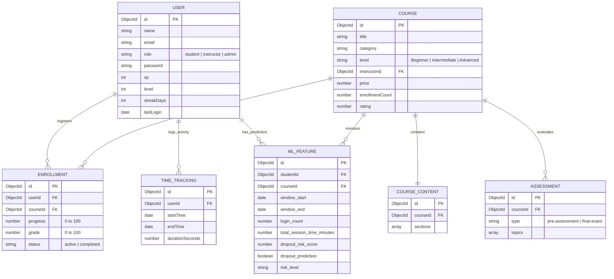
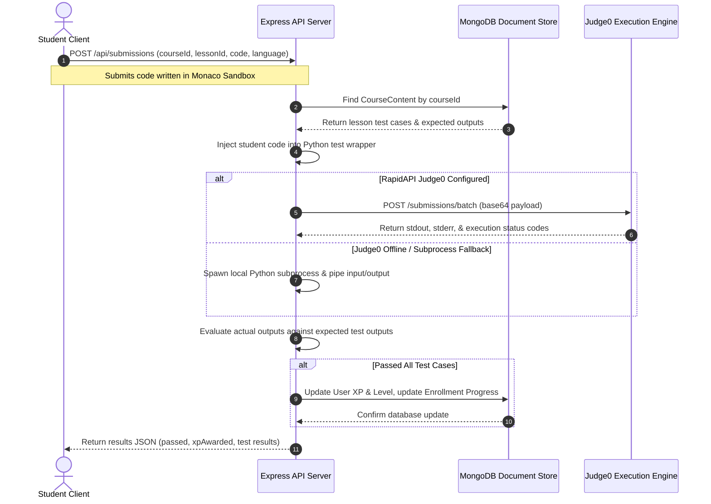

# STRIDE: COMPREHENSIVE FINAL PROJECT REPORT

---

## 1. ABSTRACT

**Stride** is a modern, full-stack course management and gamified learning platform designed to bridge the gap between instructors and students in digital education. The platform addresses the lack of unified, interactive learning experiences by providing a comprehensive ecosystem where students can discover, enroll in, and complete courses while instructors can build and manage course content efficiently. 

Leveraging a modern technology stack including React 18 for responsive client interfaces, a Node.js/Express backend API gateway with custom credentials authentication, and MongoDB for document-oriented data storage, Stride integrates real-time sandboxed code execution (using Judge0 API and local fallbacks), gamified learning loops (XP, levels, and public leaderboards), and Python-based machine learning microservices (recommender system and weekly student dropout risk prediction). This report outlines the system design, UML architecture, AI implementations, verification test suites, and final project outcomes.

---

## 2. BACKGROUND & MOTIVATION

### 2.1 Introduction to Online Learning Platforms
Online learning has transitioned from a supplementary educational tool to a core pillar of modern academic and professional training. However, legacy systems often suffer from low engagement rates, high student dropout probabilities, and a lack of integrated interactive playgrounds, particularly in technical fields.

### 2.2 Project Motivation
Stride was developed to unify fragmented aspects of online learning (content delivery, assessment, progress tracking, coding playground, and predictive analytics) into a single, cohesive dashboard.

### 2.3 Beneficiaries
*   **Students**: Receive structured paths, gamified progression (XP/level-ups), coding playgrounds with instant feedback, and personalized course recommendations.
*   **Instructors**: Gain simple course creation tools (CMS) and predictive student engagement dashboards to identify at-risk learners early.
*   **Administrators**: Moderate content, verify courses, and manage global platform roles.

---

## 3. PROJECT SPECIFICATIONS & UML DIAGRAMS

### 3.1 Architectural Layering
Stride employs a decoupled, multi-service architecture:
*   **Presentation Layer**: Single Page Application built with React 18, Vite, and Tailwind CSS.
*   **Gateway Layer**: Express.js API gateway managing authentication, route guards, and downstream service coordination.
*   **Database Layer**: MongoDB document store managed via Mongoose ODM.
*   **AI Microservices**: Dual FastAPI services running on independent ports (Port 8000 for Recommender, Port 8001 for Dropout Predictor).

---

### 3.2 Use Case Diagram

The use case diagram illustrates student, instructor, and admin interaction paths:

```mermaid
leftToRightDirection
actor Student
actor Instructor
actor Admin

rectangle Stride_Platform {
    Student --> (Browse Course Catalog)
    Student --> (Enroll in Course)
    Student --> (Complete Pre-Assessment & Final Exam)
    Student --> (Submit Code in Monaco Sandbox)
    Student --> (View Streaks & XP Leaderboard)
    Student --> (View Personalized Recommendations)
    
    Instructor --> (Create Courses & Lessons)
    Instructor --> (Add Coding Challenges & Test Cases)
    Instructor --> (Configure Assessments)
    Instructor --> (Monitor Student Engagement Analytics)
    Instructor --> (View Dropout Risk Alerts)
    
    Admin --> (Verify & Publish Courses)
    Admin --> (Manage User Roles & Access)
    Admin --> (Monitor Platform Revenue & Signups)
}
```

---

### 3.3 System Entity Relationship Diagram (ERD)

The database schema relationships within the MongoDB instance are defined below:



---

### 3.4 Coding Exercise Grading Sequence Diagram

The sequence of events from when a student submits python code in the Monaco Sandbox player to when correct results and XP are awarded:



---

### 3.5 Security & Sandbox Isolation

Stride adopts a defense-in-depth approach to platform security, addressing user authentication, data transmission, access control, and untrusted code execution.

1. **Authentication & Session Tokens**:
   - **Custom Credentials Authentication**: User registration and login flow are handled natively by custom backend Express endpoints. Passwords are securely hashed with bcrypt before storing them in MongoDB.
   - **JWT Guards**: Successful logins generate cryptographically signed JWT tokens on the Node.js backend. This token is passed via the `Authorization: Bearer <token>` header, verified by Express middleware (`verifyToken`), and protected in transit by HTTPS/TLS.

2. **Role-Based Access Control (RBAC)**:
   - Specific user roles (`Student`, `Instructor`, `Admin`) are mapped to endpoints.
   - Access to course creation, student dropout alerts, and platform metrics is enforced via the `requireRole` backend middleware to prevent unauthorized API requests (e.g., preventing a student from updating course content or accessing another user's ML predictions).

3. **Coding Sandbox Isolation**:
   - Stride executes code written in the Monaco editor in a multi-tiered environment:
     - **Containerized Judge0 API (Primary)**: Code is evaluated inside isolated sandboxes with strict execution timeouts (5s limits) and restricted memory allocations to prevent CPU/memory exploitation.
     - **Piped Subprocess Runner (Fallback)**: When Judge0 is offline, local execution routes inputs and outputs purely via piped stdin/stdout, isolating code logic inside specific Python wrapper functions rather than shell commands.

4. **Input Sanitization & DDoS Protection**:
   - **SQL Injection Prevention**: Using MongoDB (NoSQL) with Mongoose prevents SQL compilation attacks. Mongoose enforces strict schema matching and automatically sanitizes/casts parameters, blocking NoSQL parameter manipulation (e.g. stripping unexpected queries like `$ne`).
   - **DDoS Mitigation**: By routing requests through Vercel Edge networks or CDN platforms like Cloudflare, volumetric DDoS attacks are mitigated at the network layer. Size limits on Express payloads (50MB cap) and code sandbox run-times (5s timeout) prevent Denial of Service (DoS) by resource exhaustion.

### 3.6 Production Hardening & Risks

Before deploying Stride to a production setting, the following development-time risks must be hardened:
1. **Arbitrary Code Execution in Fallback Runner**: The local Python subprocess fallback (`child_process.spawn`) must be disabled in production. Otherwise, a lack of connection to Judge0 will cause untrusted code to run directly on the host server without container sandboxing.
2. **Default JWT Secrets**: The fallback token secret (`'secret'`) must be disabled, and the server must crash at startup if `ACCESS_TOKEN_SECRET` is not set to a secure, long string.
3. **Mock Billing**: Disable mock Stripe payments in production to prevent fake checkout bypasses.

---

## 4. ARTIFICIAL INTELLIGENCE PLAN

### 4.1 Hybrid Recommender System (Port 8000)
The recommender microservice uses FastAPI and implements a four-layered pipeline:
1.  **Content-Based Similarity (Layer 1)**: Computes TF-IDF vectors of course titles, descriptions, and tags. Measures cosine similarities between the catalog and courses the student has completed. Tracks match sources to generate the UI reason: *"Similar to [Completed Course Title]"*.
2.  **Collaborative Filtering (Layer 2)**: Employs Jaccard similarity matrices over mutual course enrollments to suggest items taken by peers: *"Highly rated by students with similar profiles"*.
3.  **Knowledge-Based Logic (Layer 3)**: Case-insensitively checks prerequisites against completion records (*"Building on your study of..."*). Prevents category-progression deadlocks by checking if lower-level courses are present in the catalog before applying advanced level filters.
4.  **Hybrid Re-ranking & Explainability (Layer 4)**: Normalizes scores and blends them with popularity (log-scaled enrollment and ratings) and exponential freshness decay.

---

### 4.2 Student Dropout Prediction Model (Port 8001)
To improve student retention, the platform processes behavioral metrics over a rolling 7-day window. Features are fed into a pre-trained Scikit-Learn Random Forest pipeline to generate warnings:
*   **Weekly Raw ML Features**: Login counts, active days, session lengths, lessons completed, assessments attempted, average score, and repeated/failed attempts.
*   **Inference Pipeline**: Classifies students with a dropout risk score $> 0.7$ as *"High Risk"* (`dropout_prediction: true`). At-risk students are flagged on the instructor analytics dashboard.

---

## 5. SYSTEM VERIFICATION & TESTING

To verify operational safety, a native unit and integration testing suite was implemented:
1.  **Backend Controllers (Node.js Native Runner)**: Verifies registration/login flows, JWT auth, course catalog queries, quiz sanitization, and Monaco execution code wrappers. Runs in isolation with in-memory model stubs.
2.  **AI Services (Python Unittest)**: Tests recommendation similarities, prerequisite checks, progression deadlocks, and dropout classifications.

### Automated Test Commands & Results:
*   **Express API (15/15 Passed)**: `node --test server/tests/*.test.js`
*   **Recommender (6/6 Passed)**: `python -m unittest recommender_service/tests/test_recommender_logic.py`
*   **Dropout Model (1/1 Passed)**: `python -m unittest dropout_service/tests/test_dropout_service.py`

---

## 6. PROJECT OUTCOMES & CONCLUSION

Stride successfully delivers a unified, gamified online course management and learning environment. By combining modern web engineering (React 18 + Node.js) with FastAPI machine learning models, the platform demonstrates how analytics and gamification can improve student retention and course discovery. All components are tested, verified, and ready for deployment.
