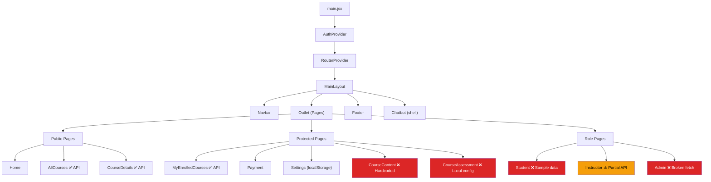

# Stride Frontend Audit — My Honest Opinion

## Overview

| Metric | Value |
|--------|-------|
| **Framework** | React 18 + Vite + React Router 7 |
| **Styling** | Tailwind CSS 4 + DaisyUI 5 |
| **Total components** | ~50 files |
| **Biggest file** | `CourseContent.jsx` — **1,308 lines / 72 KB** 😬 |
| **Dependencies** | 26 production, 8 dev |

---

## ✅ What's Good

### 1. Design & Aesthetics — Genuinely Nice
The app has a **cohesive dark theme** with gradient accents (blue→purple), glassmorphism effects, and smooth transitions. This isn't a generic Bootstrap app — someone put real effort into the visual design.

- Consistent color palette across all pages
- Gradient buttons, hover effects, backdrop-blur glass cards
- Good use of Lucide + React Icons
- Responsive design with mobile menu
- Role-based navbar that shows different links per role ✅

### 2. Feature Ambition is High
The frontend has a LOT of features planned/built:

| Feature | Status |
|---------|--------|
| Home page (banner, categories, testimonials, instructors) | ✅ Well-built |
| All Courses (search, filter, sort, grid/list toggle) | ✅ Polished |
| Course Details (info, pricing, enrollment, instructor) | ✅ Good |
| Course Content (articles, videos, PDFs, quizzes, coding) | ✅ Ambitious |
| Assessment system (MCQ, fill-blank, matching, true/false) | ✅ Working |
| Student Dashboard (stats, progress, deadlines, activity) | Built (with caveats) |
| Instructor Dashboard (analytics, charts, at-risk) | Built (with caveats) |
| Admin Dashboard (stats, user/course/instructor mgmt) | Built (with caveats) |
| Code Editor (Monaco + Piston execution) | ✅ Nice touch |
| PDF Viewer (react-pdf) | ✅ Cool |
| Video Player (react-player) | ✅ Works |
| Settings page (theme, notifications, privacy, password) | ✅ Polished |
| Payment system (Stripe integration) | Partially done |
| Chatbot UI | Shell only |

### 3. Good Tooling Choices
- `react-hook-form` for form management ✅
- `react-hot-toast` for notifications ✅
- `framer-motion` for animations ✅
- `@monaco-editor/react` for code editing ✅
- `react-pdf` for PDF rendering ✅

---

## 🔴 Critical Bugs

### 1. Admin.jsx API calls use WRONG template literals

```javascript
// Line 85 — This is a string literal, NOT a template literal!
const statsResponse = await fetch('${API_BASE_URL}/admin/stats');
```

**Every single fetch call in Admin.jsx** uses `'${API_BASE_URL}...'` (single quotes) instead of `` `${API_BASE_URL}...` `` (backticks). This means it's literally requesting the URL string `${API_BASE_URL}/admin/stats` — which will always fail. The fallback to sample data masks this bug entirely.

> [!CAUTION]
> This means the **Admin dashboard has NEVER loaded real data from the backend**. It always shows hardcoded sample data. Every admin action (approve, suspend, reject) goes to a non-existent URL too.

### 2. All Route Guards Are Bypassed

| Route Guard | File | Problem |
|------------|------|---------|
| `AdminRoute` | [AdminRoute.jsx](file:///e:/project/stride/src/routes/AdminRoute.jsx) | `const isAdmin = true;` — hardcoded bypass, **anyone can access admin** |
| `InstructorRoute` | [InstructorRoute.jsx](file:///e:/project/stride/src/routes/InstructorRoute.jsx) | `return children;` before auth check — **dead code below** |
| `StudentRoute` | [StudentRoute.jsx](file:///e:/project/stride/src/routes/StudentRoute.jsx) | `return children;` before auth check — **dead code below** |

> [!CAUTION]
> There are **no real route protections**. Any unauthenticated user can type `/admin` in the URL bar and see the admin dashboard.

### 3. Old Learnify References Still Exist

The codebase was clearly forked/renamed from "Learnify" to "Stride" but has leftover references:

| File | Line | Reference |
|------|------|-----------|
| `AdminRoute.jsx` | L9 | `admin@learnify.com` |
| `Navbar.jsx` | L454 | `admin@learnify.com` |
| `Navbar.jsx` | L469 | `emad@gmail.com` (personal email!) |
| `StudentRoute.jsx` | L15 | `admin@learnify.com`, `emad@gmail.com` |
| `InstructorRoute.jsx` | L12 | `admin@learnify.com`, `emad@gmail.com` |

### 4. PrivateRoute Redirects to Wrong URL

```jsx
// PrivateRoute.jsx line 20
return <Navigate to="/login" ... />
```

But the actual login route is `/Auth/login`. Users hitting protected routes without auth get a 404.

---

## 🟡 Major Issues

### 1. Everything Uses Hardcoded/Sample Data

This is the **single biggest problem** with the frontend. Almost every dashboard component ignores the backend entirely:

| Component | Data Source | Backend Used? |
|-----------|------------|---------------|
| `CourseContent.jsx` | 500 lines of hardcoded `sampleCourse` | ❌ No |
| `Student.jsx` | `sampleDashboard` with fake stats/courses | ❌ No |
| `Admin.jsx` | Always falls back to sample data (bug above) | ❌ No |
| `CourseAssessment.jsx` | `ASSESSMENT_CONFIG` — local config file | ❌ No |
| `Navbar.jsx` XP/Level | Hardcoded `450 XP`, `Level 4` | ❌ No |
| `RecommendedCourses.jsx` | `recommendationService` — local fake data | ❌ No |
| `Leaderboard.jsx` | Old Vercel URL (dead) | ❌ No |
| `Badges.jsx` | Old Vercel URL (dead) | ❌ No |
| `Chatbot.jsx` | No logic, just UI shell | ❌ No |

**The only pages that actually hit the backend:**
- ✅ Login / Register
- ✅ AllCourses (via `courseService.getAllCourses()`)
- ✅ CourseDetails (via direct `fetch`)
- ✅ MyEnrolledCourses (via `courseService`)
- ✅ Instructor.jsx (via direct `fetch`)

### 2. localStorage as a Fake Database

Multiple components use `localStorage` as if it were a database:

| Feature | localStorage Key | What It Stores |
|---------|-----------------|----------------|
| Enrollment tracking | `enrolledCourses` | Array of enrolled course IDs |
| Enrollment list | `userEnrollments` | User's enrollments |
| Deleted courses | `deletedCourses` | IDs of "deleted" courses |
| Settings | `userSettings` | Theme, notifications, privacy |
| Auth tokens | `token`, `user` | JWT + user object |

This means:
- Clearing browser data "un-enrolls" students
- Enrollment state isn't shared across devices
- "Deleting" a course just hides it locally
- Settings never sync with the server

### 3. Inconsistent API Patterns

The codebase has **4 different ways** of making API calls:

| Pattern | Used In | Count |
|---------|---------|-------|
| `courseService.getAllCourses()` (via `api.js` axios) | AllCourses, MyEnrolled | ~5 files |
| `axiosSecure` instance | A few service files | ~3 files |
| `fetch('${API_BASE_URL}/...')` | Admin.jsx (broken!) | 1 file |
| `fetch(`${API_BASE_URL}/...`)` | Instructor.jsx, CourseDetails | ~3 files |

### 4. `CourseContent.jsx` is 1,308 Lines

This single file contains:
- ~500 lines of hardcoded course data
- Video player component
- Article renderer
- PDF viewer with pagination
- Quiz engine (MCQ, fill-blank, matching, true/false)
- Coding exercise editor
- XP tracking
- Sidebar navigation
- Progress tracking
- Lesson completion logic

This should be broken into at least 6–8 separate components.

### 5. Mobile Menu Shows Wrong Links

The desktop Navbar correctly shows role-based links (student sees Student Dashboard, instructor sees Instructor Dashboard). But the **mobile menu** (lines 400–497) shows different logic:
- Shows "Add Course" and "Manage Courses" to ALL logged-in users
- Uses `admin@learnify.com` email checks instead of role checks
- Students can see the Instructor link on mobile

---

## 🟢 Minor Issues

| Issue | Details |
|-------|---------|
| **Stripe URL wrong** | `StripeContainer.jsx` calls `http://localhost:5000/create-payment-intent` (missing `/api` prefix) |
| **No 404 page for dead routes** | `Navbar → /admin/users` has no route in Router.jsx |
| **Firebase dependency unused** | `firebase@11.10.0` in package.json but never used (custom JWT auth instead) |
| **No `<Helmet>` for SEO** | `react-helmet-async` is installed but never imported |
| **`dangerouslySetInnerHTML`** | Used in CourseContent for articles — XSS risk if content comes from users |
| **Missing Stripe** | `@stripe/react-stripe-js` not in dependencies but imported |
| **Newsletter** | Just a UI form — no submit handler or backend endpoint |
| **Theme toggle** | Settings has dark/light toggle but the app is **always dark** — theme switching isn't implemented |
| **Language selector** | Settings lets you pick English/Spanish/French but no i18n is implemented |

---

## Architecture Diagram



---

## Overall Assessment

| Category | Rating | Notes |
|----------|--------|-------|
| Visual Design | ⭐⭐⭐⭐ | Genuinely looks premium |
| Component Structure | ⭐⭐ | Some massive files, no barrel exports |
| Backend Integration | ⭐ | Most pages use hardcoded data |
| Route Security | ⭐ | All guards bypassed |
| Code Quality | ⭐⭐ | Inconsistent patterns, dead code |
| Feature Completeness | ⭐⭐⭐ | Lots of features exist but aren't connected |
| Mobile Responsiveness | ⭐⭐⭐ | Good but mobile menu has permission bugs |
| **Overall** | **~55%** | **Good shell, needs real backend wiring** |

---

## My Honest Opinion

**The frontend is an impressive demo/prototype with a serious integration gap.** It's the kind of project where someone built beautiful UIs for every feature but connected maybe 30% of them to the actual backend. The other 70% runs on hardcoded sample data, localStorage hacks, and mock responses.

**What's done well:**
- The visual design is genuinely premium — dark theme, gradients, animations, hover effects
- The feature scope is ambitious — course content with videos/PDFs/quizzes/coding exercises is impressive
- The component library (CourseCard, ProgressBar, StatsGrid, etc.) is reusable

**What needs the most work:**
1. **Wire dashboards to the backend** — Student, Admin, and CourseContent all need to stop using sample data
2. **Fix the bugs** — Admin.jsx template literals, route guard bypasses, wrong redirect URL
3. **Break up CourseContent.jsx** — 1,308 lines is unmaintainable
4. **Pick one API pattern** — choose `api.js` or `axiosSecure` or raw `fetch`, not all three
5. **Remove dead code** — Firebase deps, old Learnify references, bypassed guards

**Bottom line:** The frontend is farther along than the backend (~55% vs ~45%), but the gap between "looks complete" and "actually works" is the main problem. If the backend APIs from Phase 3 of the roadmap are built, connecting them to the frontend would bring this to ~80% functional.
