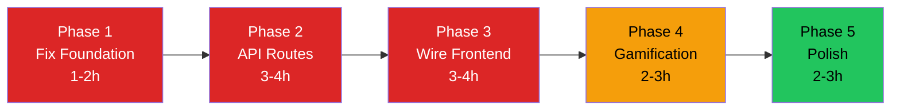

# Stride — Updated Project Roadmap
## Matched Against Proposal #31 (Adjusted Scope)

> Adaptive learning engine, difficulty scaling, and content recommendations are **excluded** from scope.

---

## Proposal vs Reality — Status Summary

| Proposal Feature | Score | Key Gap |
|-----------------|-------|---------|
| Full-Stack App (React + Node + MongoDB) | 80% | No auth middleware |
| User Management (register, login, roles) | 70% | Route guards bypassed, no JWT verification |
| Course Dashboard | 30% | Student dashboard uses hardcoded data |
| Gamification (XP, badges, leaderboard) | 30% | UI exists, not wired to backend |
| Interactive Content Players (quiz, code, video, PDF) | 85% | Works but loads hardcoded data |
| Admin & Instructor CMS | 55% | Editors built but can't save to DB |
| Assessment System | 60% | Works locally, no backend submission |
| **Overall** | **~50%** | **Frontend-backend integration gap** |

---

## Phase 1: Fix the Foundation 🔴 (~1-2 hours)

| # | Task | Why |
|---|------|-----|
| 1.1 | **Fix seed script** — update `enrollmentCount` on courses, `enrolledCourses` on users, populate `studentmetrics` | All counts show 0 despite 20 enrollments |
| 1.2 | **Create `server/middleware/auth.js`** — JWT verification + `requireRole()` middleware | Every endpoint is unprotected |
| 1.3 | **Apply auth middleware** to all protected routes (only `/api/auth/*` and `GET /api/courses` stay public) | Proposal: "Secure auth and role-based access" |
| 1.4 | **Fix route guards** — `AdminRoute.jsx` (`isAdmin = true`), `InstructorRoute.jsx` and `StudentRoute.jsx` (`return children` before check) | Anyone can access `/admin` |
| 1.5 | **Fix `Admin.jsx` template literals** — `'${API_BASE_URL}'` → `` `${API_BASE_URL}` `` (backticks) | Admin dashboard has never loaded real data |
| 1.6 | **Fix `PrivateRoute.jsx` redirect** — `/login` → `/Auth/login` | Users get 404 on protected routes |
| 1.7 | **Drop ghost `stride` collection**, clean Learnify references | Cleanup |

---

## Phase 2: Missing Backend API Routes 🔴 (~3-4 hours)

| # | Task | Details |
|---|------|---------|
| 2.1 | **CourseContent API** | `GET /api/courses/:id/content` — serve content from DB |
| | | `PUT /api/courses/:id/content` — instructor saves/updates content |
| 2.2 | **Assessment API** | `GET /api/courses/:id/assessment` — fetch assessment questions |
| | | `POST /api/courses/:id/assessment/submit` — submit answers, auto-grade, update enrollment grade |
| 2.3 | **Leaderboard API** | `GET /api/leaderboard` — top students sorted by XP |
| 2.4 | **Badges API** | `GET /api/student/badges?email=...` — return earned badges based on XP thresholds and achievements |
| 2.5 | **XP Award endpoint** | `POST /api/users/award-xp` — add XP, auto-recalculate level |
| 2.6 | **Missing admin routes** | `GET /api/admin/at-risk-students`, `POST /api/admin/send-reminder/:id`, `GET /api/admin/student-activity`, `GET /api/admin/retention-metrics` |
| 2.7 | **Implement admin stubs** | Course approve/reject → actually change `status`. User ban/activate → add `status` field to User model |
| 2.8 | **StudentMetric API** | `GET /api/metrics/student/:id` — for instructor at-risk dashboard |

---

## Phase 3: Wire Frontend to Backend 🔴 (~3-4 hours)

| # | Component | Currently Uses | Wire To |
|---|-----------|---------------|---------|
| 3.1 | `CourseContent.jsx` | 500 lines of `sampleCourse` hardcoded data | `GET /api/courses/:id/content` |
| 3.2 | `Student.jsx` | `sampleDashboard` with fake stats/courses/deadlines | Real enrollment + user data from API |
| 3.3 | `Admin.jsx` | Always falls back to sample data (broken template literals) | Fix fetch calls + use `api.js` |
| 3.4 | `CourseAssessment.jsx` | Local `AssessmentConfig.jsx` file | `GET /api/courses/:id/assessment` + submit to API |
| 3.5 | `Leaderboard.jsx` | Dead `vercel.app` URL | `GET /api/leaderboard` |
| 3.6 | `Badges.jsx` | Dead `vercel.app` URL | `GET /api/student/badges` |
| 3.7 | `XPCounter.jsx` + Navbar | Hardcoded `xp = 450` | Real `user.xp` from auth context |
| 3.8 | `Achievements.jsx` | Hardcoded `450` XP, fake activity | Real user XP + badge data from API |
| 3.9 | **Consolidate API pattern** — use `api.js` everywhere, remove `axiosSecure.js` and raw `fetch` calls | 4 different patterns → 1 |
| 3.10 | **Fix `StripeContainer.jsx`** URL — add `/api` prefix | Missing `/api` prefix |

---

## Phase 4: Complete Gamification 🟡 (~2-3 hours)

| # | Task | Proposal Requirement |
|---|------|---------------------|
| 4.1 | **Auto-award XP** when lesson completed, quiz passed, or coding exercise solved (call `POST /api/users/award-xp` from frontend) | "XP awarded for completing modules, quizzes, challenges" |
| 4.2 | **Define badge thresholds** — create badge definitions in backend (e.g., "First Course" = 1 enrollment, "Quiz Master" = 5 quizzes, "Perfect Score" = 100% on assessment) | "Badges for specific achievements" |
| 4.3 | **Leaderboard with privacy** — respect Settings privacy toggle, hide user from leaderboard if opted out | "Leaderboard with optional privacy settings" |
| 4.4 | **Wire Navbar XP/Level display** to real `user.xp` and `user.level` from auth state | Currently shows hardcoded `450 XP | Level 4` |
| 4.5 | **Add streak tracking** — track consecutive daily logins in User model, display in Student dashboard | Student.jsx shows hardcoded "4 Day Streak!" |
| 4.6 | **Assessment → grade update** — when student submits assessment, update `enrollment.grade` via API | All 20 enrollments have `grade: 0` |

---

## Phase 5: Polish & Deliverables 🟢 (~2-3 hours)

| # | Task |
|---|------|
| 5.1 | **Break up `CourseContent.jsx`** (1,308 lines) — extract VideoPlayer, ArticleViewer, QuizPlayer, CodingExercise, LessonSidebar |
| 5.2 | **Admin analytics** — replace "Analytics chart would go here" placeholders with real charts using enrollment/revenue data |
| 5.3 | **Fix mobile menu** — match role-based links to desktop navbar logic |
| 5.4 | **Remove dead code** — Firebase dependency (unused), old Learnify email references, dead Vercel URLs |
| 5.5 | **Input validation** — add `express-validator` on critical endpoints (auth, enrollment, course create) |
| 5.6 | **Chatbot** — either implement basic FAQ logic or remove the shell |
| 5.7 | **Theme toggle** — either implement light mode or remove the toggle from Settings |
| 5.8 | **Write API documentation** (proposal deliverable) |

---

## Priority & Timeline

```
🔴 MUST DO (core proposal requirements)
   Phase 1: Fix Foundation                  ~1-2 hours
   Phase 2: Missing API Routes              ~3-4 hours
   Phase 3: Wire Frontend to Backend        ~3-4 hours

🟡 IMPORTANT (proposal gamification objective)
   Phase 4: Complete Gamification           ~2-3 hours

🟢 POLISH (quality + deliverables)
   Phase 5: Polish & Deliverables           ~2-3 hours

Total: ~12-17 hours
```

---

## Execution Order



Phases are sequential — each depends on the previous one. Start with Phase 1.
